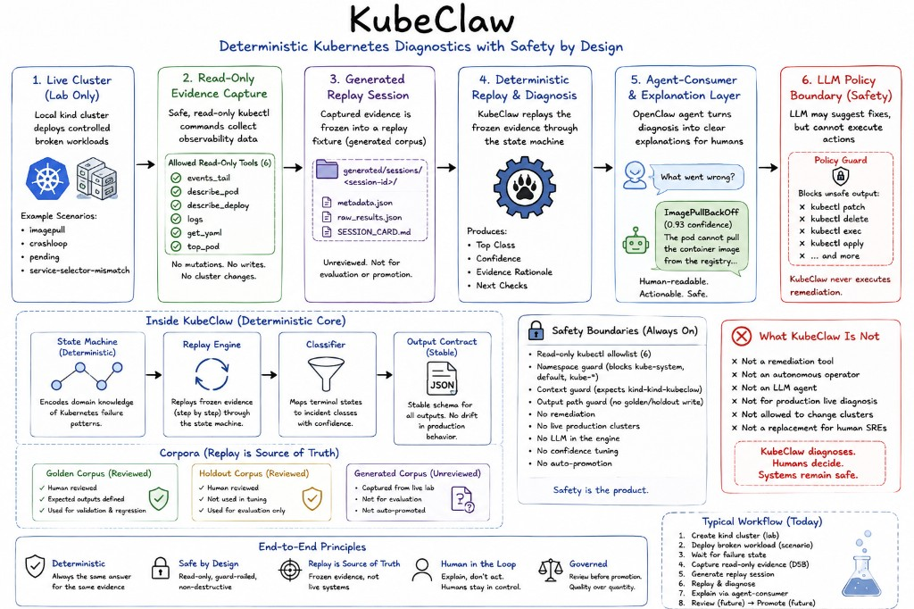

# KubeClaw

KubeClaw is a deterministic Kubernetes diagnostic engine designed around safety-first infrastructure automation.

## Important distinction

**KubeClaw itself is not AI.**

- It is not an LLM.
- It is not an autonomous Kubernetes agent.
- It does not patch workloads.
- It does not run remediation.
- It does not let an LLM execute kubectl.

It is a deterministic, safety-bounded diagnostic layer that future AI systems could sit behind.

Given frozen read-only evidence from a bounded set of diagnostic tools, KubeClaw validates and redacts inputs, extracts facts, classifies incidents, ranks hypotheses, computes calibrated confidence, optionally performs one bounded drift recheck, and produces reproducible reports. The same evidence always produces the same diagnosis.



---

## Current demo flow

```
local kind cluster
  → controlled broken workload
  → read-only evidence capture
  → generated replay session
  → deterministic diagnosis
  → optional agent explanation
  → optional LLM policy boundary
```

Most demos run fully offline against frozen replay evidence. No live cluster is required for diagnosis, evaluation, or the sample outputs in this repository.

See [docs/demo-walkthrough.md](docs/demo-walkthrough.md) for a guided walkthrough and [sample-output/](sample-output/) for representative engine and agent outputs.

---

## What it demonstrates

- **Deterministic replay-based diagnosis** — same evidence always produces the same classification, confidence, and report
- **Read-only evidence capture** — six logical tools, no write or mutation verbs
- **Safety refusals** — unsafe cluster context or namespace targets are refused immediately; refusal is terminal
- **Drift recomputation** — one bounded recheck with full pipeline recomputation; confidence does not inflate after drift
- **Agent-consumer explanation layer** — a deterministic prototype that explains KubeClaw output without overriding it
- **LLM policy boundary** — offline prompt building and candidate validation; no real LLM is called
- **Human-in-the-loop governance** — golden and holdout corpora are governed; generated sessions are unreviewed until promoted

---

## Current status

At the time of writing, the private implementation repository includes:

- Deterministic Kubernetes diagnosis engine
- Golden replay corpus (development regression)
- Holdout evaluation corpus (evaluation-only)
- Drift recomputation with non-inflation invariant
- Safety refusals (context guard, namespace guard)
- OpenClaw agent-consumer layer
- LLM policy boundary scaffold
- Local kind live-lab with read-only evidence capture pipeline
- **766 passing tests**

The test count reflects the private implementation repository at the time of writing.

---

## What KubeClaw is not

| Not this | Why |
| --- | --- |
| A remediation tool | Strictly read-only. All write verbs are refused. |
| An autonomous operator | No cluster mutation, no kubectl execution by the engine. |
| A production live diagnosis system | Replay evidence is the source of truth; live capture is local-lab only. |
| An LLM agent | Engine logic is deterministic code, not model inference. |
| A replacement for human SREs | Produces reports and refusals; humans decide what to do next. |
| Allowed to mutate clusters | Safety is enforced in code, not prompts. |

---

## Incident classes

Exactly five incident classes are supported:

| Class | Description |
| --- | --- |
| `crashloop` | Container repeatedly fails and restarts |
| `imagepull` | Image cannot be pulled from registry |
| `pending` | Pod cannot be scheduled |
| `service_unreachable` | Service has no reachable endpoints |
| `oom` | Container killed by OOM killer |

Special outcomes: `insufficient_evidence` (valid when evidence does not support a confident conclusion) and **refusal** (safety outcome when a request violates the safety model).

---

## Repository note

The full implementation repository is currently private while the project is under active development. This showcase repo documents the architecture, safety model, and demo outputs.

---

## Documentation

| Document | Purpose |
| --- | --- |
| [docs/architecture.md](docs/architecture.md) | Data flow, invariants, and component overview |
| [docs/demo-walkthrough.md](docs/demo-walkthrough.md) | How to present KubeClaw in 3–10 minutes |
| [docs/live-fixture-pipeline.md](docs/live-fixture-pipeline.md) | Optional local kind lab and read-only capture pipeline |
| [docs/safety-model.md](docs/safety-model.md) | Safety boundaries, guards, and governance rules |

## Sample outputs

| File | Demonstrates |
| --- | --- |
| [sample-output/engine-imagepull-demo.txt](sample-output/engine-imagepull-demo.txt) | Normal deterministic diagnosis |
| [sample-output/engine-drift-demo.txt](sample-output/engine-drift-demo.txt) | Drift recomputation and class flip |
| [sample-output/engine-refusal-demo.txt](sample-output/engine-refusal-demo.txt) | Safety refusal (terminal) |
| [sample-output/agent-consumer-demo.txt](sample-output/agent-consumer-demo.txt) | OpenClaw agent explanation layer |
| [sample-output/llm-policy-demo.txt](sample-output/llm-policy-demo.txt) | LLM adapter prompt preview and policy rejection |
