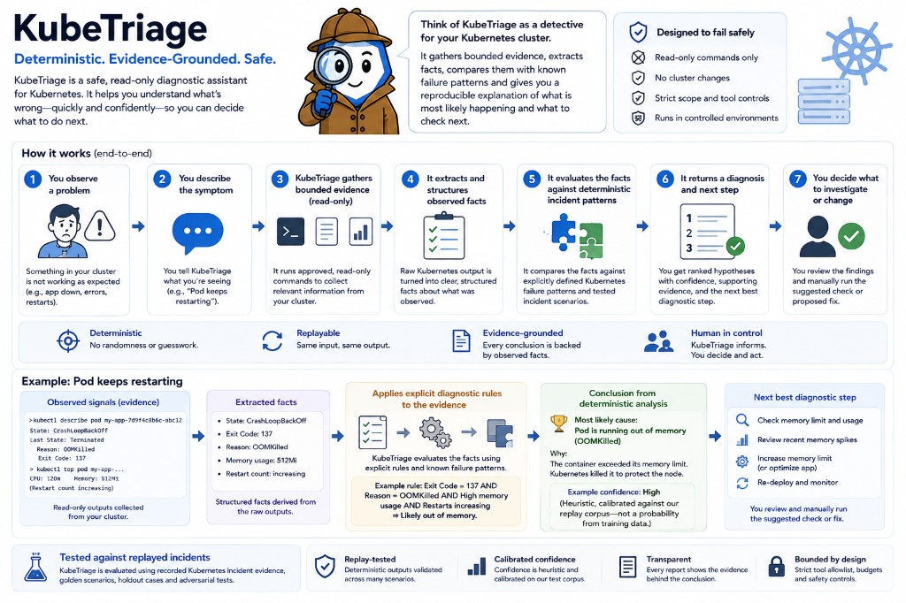

# KubeTriage

**A deterministic evidence engine for bounded Kubernetes incident diagnosis.**

KubeTriage is a deterministic evidence engine for bounded incident diagnosis.
The current implementation applies that model to Kubernetes: it turns governed
operational evidence into replayable, evidence-backed diagnoses with exact
provenance. The same evidence always produces the same result.

Diagnostic authority is deterministic code. There is no LLM in the engine, no
admitted autonomous AI agent, no remediation, and no production live-diagnosis
service.



## Why it exists

Production incidents rarely fail on a single signal. Engineers often have to
correlate workload state, configuration, events, logs, and related observations
before they can defend a conclusion.

That process is slow to replay and easy to dispute. Near critical
infrastructure, an explanation should not invent evidence, change the diagnosed
problem, inflate confidence, continue after a safety refusal, or turn a
suggestion into a cluster action.

KubeTriage is intended to make diagnostic reasoning:

- **bounded** — operate only on governed evidence and supported classes;
- **reproducible** — same evidence, same diagnosis;
- **inspectable** — conclusions link to exact evidence locations;
- **evidence-backed** — unsupported conclusions are rejected;
- **confidence-aware** — confidence is derived from explicit evidence inputs.

Diagnosis and explanation remain separate. Diagnosis is deterministic and
evidence-grounded. A future explanation layer may describe an admitted result —
it would not be allowed to change it.

## Observability vs diagnosis

Observability systems show what changed, where failures appeared, which metrics
moved, and what behaviour was observed.

KubeTriage answers a different question:

> Given the available evidence, what is the most likely explanation, how
> confident is that conclusion, and exactly which evidence supports it?

KubeTriage does not replace observability. Observability produces evidence;
KubeTriage reasons over governed evidence. Humans remain responsible for
deciding and performing remediation.

## What it does today

Current implemented capability, proven on the governed Kubernetes replay path:

- Frozen, read-only **Kubernetes-native** evidence via a strict six-tool
  allowlist (`events_tail`, `describe_pod`, `describe_deploy`, `logs`,
  `get_yaml`, `top_pod`)
- Evidence validation, redaction, and canonicalisation
- Typed fact extraction with exact citations
- Seven bounded incident classes (below)
- Hypothesis ranking and confidence scoring from explicit evidence inputs
- At most one bounded drift recheck with full recomputation
- Immutable run manifest and claim → fact → evidence provenance
- Safety refusal and `insufficient_evidence` outcomes
- Offline evaluation against golden, holdout, adversarial, and metamorphic
  controlled corpora

Given that frozen Kubernetes evidence, KubeTriage:

1. validates the request and redacts secrets, tokens, and sensitive material;
2. extracts typed facts with exact citations;
3. classifies against seven bounded incident classes;
4. ranks hypotheses and scores confidence from explicit evidence inputs;
5. optionally performs one bounded drift recheck when new evidence arrives;
6. seals an immutable run manifest and provenance bundle;
7. admits operator-visible explanations only after claim → fact → evidence
   verification.

Replay is the governed diagnostic source of truth: no hidden state, no online
learning, no randomness.

## Current Kubernetes coverage

KubeTriage currently supports seven top-level deterministic incident classes:

| Class | Meaning |
| --- | --- |
| `crashloop` | Container repeatedly fails and restarts |
| `imagepull` | Image cannot be pulled from the registry |
| `oom` | Container killed by the OOM killer |
| `pending` | Pod cannot be scheduled |
| `service_unreachable` | Service has no reachable endpoints |
| `probe_failure` | Readiness or liveness probe failing |
| `config_dependency_failure` | Missing or invalid ConfigMap or Secret dependency |

Two important non-diagnostic outcomes: **`insufficient_evidence`** (honest
uncertainty) and **refusal** (safety violation — terminal, no further
processing).

These seven classes are bounded pattern-based coverage. They do not cover
Kubernetes generally.

## How it works

```text
frozen read-only evidence
  → validation and redaction
  → typed facts with exact citations
  → classification → hypothesis ranking → confidence
  → optional one bounded drift recheck (full recomputation)
  → run manifest + provenance
  → provenance-aware policy validation
  → deterministic operator-visible output
```

Six read-only logical tools only: `events_tail`, `describe_pod`,
`describe_deploy`, `logs`, `get_yaml`, `top_pod`. Write verbs (`apply`,
`patch`, `delete`, `exec`, …) are refused.

Local kind fixtures may be used to exercise or capture evidence, but the
governed diagnostic / evaluation path is replayable. There is no unrestricted
production live-diagnosis or remediation service.

Details: [Architecture](docs/architecture.md) ·
[Safety model](docs/safety-model.md) ·
[Live fixture pipeline](docs/live-fixture-pipeline.md).

## What it does not do

| KubeTriage is not | Boundary |
| --- | --- |
| An observability, monitoring, or telemetry platform | It consumes governed evidence; it does not collect or store operational telemetry. |
| An auto-remediator | No apply, patch, delete, restart, scale, or fixes. |
| An LLM diagnostic engine | No model calls or provider SDKs in the engine. |
| A trained ML diagnostic model | Behaviour is deterministic code, not learned inference. |
| A production live-diagnosis service | Governed replay evidence is the diagnostic source of truth. |
| An autonomous AI agent | No autonomous agent is connected to or admitted by KubeTriage. |
| Unrestricted incident coverage | Seven pattern-based classes today; returns `insufficient_evidence` otherwise. |
| A multi-source cloud-native evidence platform today | Broader evidence domains are architectural direction, not current capability. |

Safety is enforced in code, not prompts. See [Safety model](docs/safety-model.md).

## Current status

**Frozen diagnostic baseline:**
`v2.8.0-a6b-pre-s4-result-inventory-reviewed-baseline`

| Area | Status |
| --- | --- |
| Deterministic diagnostic engine | Implemented |
| Controlled replay evaluation | Implemented (golden 20/20, holdout 24/24) |
| Exact provenance | Implemented |
| Adversarial evaluation | **102/102** |
| Metamorphic evaluation | **67/67** |
| Real-incident corpus infrastructure | Reviewed / frozen |
| Real-incident collection | Not started |
| V2 blind real-incident evaluation | Not started |
| Autonomous AI agent | Not admitted / not present |
| Remediation | Not implemented |

Agent-admission work is intentionally paused while KubeTriage validates the
deterministic diagnostic layer against real incidents. Earlier A6 boundary and
lifecycle milestones remain historical reviewed work; they did not connect a
provider or admit an autonomous agent, and they did not change the frozen
diagnostic behaviour.

### Real-incident validation

A separate V1 real-incident corpus **infrastructure** has passed the project's
architecture and implementation review gates (local freeze:
`v1.0.0-v1-infrastructure-reviewed-baseline`; integrity suite **158 passed**).
That infrastructure is schemas, validators, provenance, projection, and
integrity tooling — not a collected corpus.

No real incident has been collected. No candidate has entered the log. No V2
real-incident evaluation has begun. No real-world diagnostic accuracy claim
exists yet.

Real-incident acquisition has not begun. The current gate is freezing the
deterministic holdout-selection procedure so the first real-incident corpus can
be collected and split without operator discretion or evaluation leakage.

## Evaluation

Golden, holdout, adversarial, and metamorphic material is controlled evaluation
material. It is not a real-incident corpus, and KubeTriage was not trained on
it.

KubeTriage currently performs strongly on its small controlled evaluation
corpus, but that does not establish real-world diagnostic reliability.

Controlled holdout metrics (14 non-drift diagnostic sessions):

| Metric | Value |
| --- | --- |
| Top-1 diagnostic accuracy | 100% |
| Brier | 0.0557 |
| ECE | 0.2186 *(above 0.15 target on this small set)* |
| False high-confidence (≥ 0.80) | 0 |

KubeTriage computes confidence from explicit evidence inputs and measures
calibration separately from diagnostic accuracy. Accuracy and calibration are
different claims. These numbers are controlled-corpus results only.

More detail and frozen digests:
**[docs/current-status.md](docs/current-status.md)** (older A6-era briefing;
baseline tag in that file is superseded by the v2.8 freeze above).

## Try the samples

Representative outputs from the main KubeTriage implementation (no live cluster
required):

### Core diagnostic demos

| Sample | Demonstrates |
| --- | --- |
| [Image-pull diagnosis](sample-output/engine-imagepull-demo.txt) | Normal deterministic diagnosis (`imagepull`, confidence 0.88) |
| [Drift class flip](sample-output/engine-drift-demo.txt) | Full drift recomputation; confidence does not inflate |
| [Safety refusal](sample-output/engine-refusal-demo.txt) | Terminal refusal for unsafe cluster context |
| [Combined session output](sample-output/demo-session-outputs.txt) | All three paths in one file |

### Provenance and evaluation

| Sample | Demonstrates |
| --- | --- |
| [Provenance-aware explanation](sample-output/provenance-aware-explanation-demo.json) | Accepted `agent_explanation/v3` under `agent_output_policy/v3` |
| [Adversarial evaluation summary](sample-output/adversarial-evaluation-summary.json) | Adversarial corpus: 102/102, zero unexpected admissions |
| [Metamorphic evaluation summary](sample-output/metamorphic-evaluation-summary.json) | Metamorphic suite v2: 67/67, pure vs mixed removal distinction |
| [Confidence decomposition](sample-output/confidence-decomposition-demo.json) | Reviewed mixed-information removal (0.72 → 0.88 explained mechanically) |

### Earlier boundary milestones (labelled legacy)

| Sample | Demonstrates |
| --- | --- |
| [Safe response envelope](sample-output/agent-safe-response-demo.json) | Earlier `agent_safe_response/v1` authority envelope — envelope-local IDs such as `ev-001` are **not** current stable fact identity |
| [Deterministic consumer](sample-output/agent-consumer-demo.txt) | Offline `agent_output_policy/v2` scaffold — not the v3 provenance path |
| [LLM policy rejection](sample-output/llm-policy-demo.txt) | Offline policy scaffold — no real LLM is called |

Presenter script: **[docs/demo-walkthrough.md](docs/demo-walkthrough.md)**.

## Current limitations

| Architectural direction | Implemented today |
| --- | --- |
| Deterministic, evidence-grounded diagnosis with provenance and replay | Yes — for governed Kubernetes-native replay evidence |
| Diagnosis separated from explanation | Yes — no autonomous explanation agent admitted |
| Multiple governed operational evidence sources | Architectural direction only — not implemented |
| Constrained explanation consumer behind the diagnostic authority | Future direction; agent-admission work paused; no provider connected |

Current implementation constraints:

- Seven pattern-based Kubernetes classes — not every Kubernetes failure mode,
  and not a claim of broad cloud-native coverage.
- Broader multi-source diagnosis (networking, DNS, identity, policy,
  infrastructure state, external observability feeds) remains architectural
  direction, not current capability.
- Small controlled evaluation corpus; calibration figures are not broad
  production claims.
- ECE remains above target and is documented, not tuned away.
- No real-incident corpus collected; no V2 real-incident evaluation yet.
- Deterministic integrity checking — not cryptographic authenticity.
- No autonomous agent, provider / model, remediation, or unrestricted
  production cluster access.

The system returns `insufficient_evidence` rather than guessing when evidence
does not justify a supported diagnosis.

## About this repository

This repository is the public showcase layer. The main
[KubeTriage](https://github.com/la-moss/KubeTriage) repository contains the
implementation and technical project history; this repository focuses on
architecture, status, and representative outputs. It does not duplicate the
full implementation, test suites, or governed replay corpora.

| Document | Purpose |
| --- | --- |
| [Current status](docs/current-status.md) | Older detailed gate table and evaluation numbers (see v2.8 baseline note above) |
| [Architecture](docs/architecture.md) | Data flow, components, and invariants |
| [Safety model](docs/safety-model.md) | Read-only boundaries, refusals, and governance |
| [Demo walkthrough](docs/demo-walkthrough.md) | How to present KubeTriage in 3–10 minutes |
| [Live fixture pipeline](docs/live-fixture-pipeline.md) | Optional local kind capture workflow |

## In one sentence

> KubeTriage is a deterministic evidence engine for bounded incident diagnosis:
> it turns governed operational evidence into replayable, evidence-backed
> conclusions — currently proven on Kubernetes-native controlled replay inputs,
> not yet validated on a real-incident corpus.
